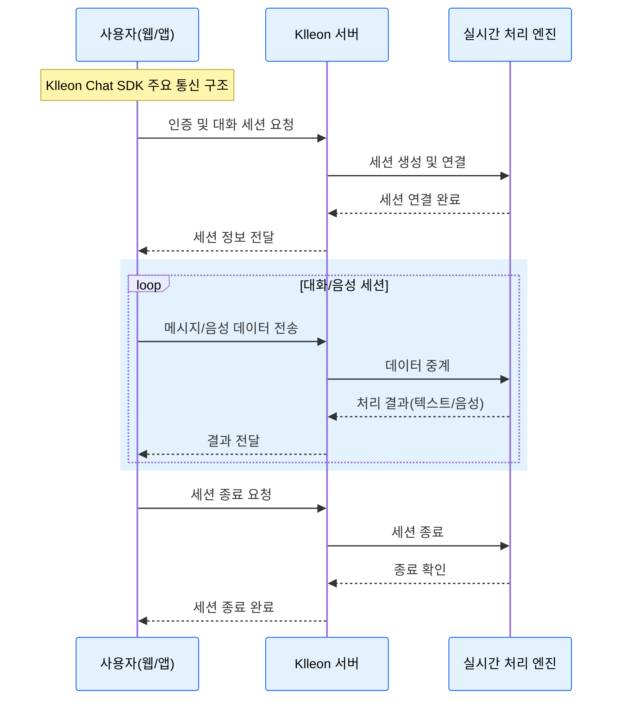

# Klleon Chat SDK 소개

Klleon Chat SDK는 웹 애플리케이션에 클레온의 실시간 인터랙티브 아바타를 손쉽게 통합할 수 있도록 제작된 JavaScript 라이브러리입니다. 이 SDK를 통해 사용자는 별도의 복잡한 WebRTC 설정이나 서버 로직 구현 없이, 몇 줄의 코드만으로 아바타와 실시간으로 소통하는 채팅 기능을 구현할 수 있습니다.

## 주요 특징

- **간편한 연동**: 웹 페이지에 `<script>` 태그를 추가하여 Klleon Chat SDK를 빠르게 설치하고, 직관적인 API를 사용하여 즉시 아바타 기능을 연동할 수 있습니다.
- **실시간 양방향 통신**: 사용자와 아바타 간의 텍스트 및 음성 메시지를 실시간으로 주고받는 사용자 경험을 제공합니다.
- **커스터마이징 가능한 UI**: 기본으로 제공되는 아바타 및 채팅 UI 컴포넌트를 사용하거나, 필요에 따라 직접 UI를 구성하여 브랜드 아이덴티티에 맞출 수 있습니다.
- **다양한 SDK 이벤트 구독**: SDK의 상태 변경 및 채팅 관련 주요 이벤트들을 구독하여 애플리케이션 로직에 맞게 활용할 수 있습니다.
- **TypeScript 타입 정의 제공**: `.d.ts` 타입 정의 파일을 제공하여, TypeScript 프로젝트에서 Klleon Chat SDK 사용 시 개발 편의성과 타입 안정성을 향상시킵니다.

## 이 문서는 누구를 위한 것인가요?

이 문서는 다음과 같은 분들을 위해 작성되었습니다:

- **웹 개발자**: 자신의 웹사이트나 웹 애플리케이션에 클레온의 아바타 채팅 기능을 구현하고자 하는 개발자.
- **프로덕트 매니저/기획자**: Klleon Chat SDK의 기능과 가능성을 파악하여 서비스에 새로운 가치를 더하고자 하는 기획자 또는 관리자.
- **모든 사용자**: Klleon Chat SDK가 무엇이며, 어떻게 활용될 수 있는지 궁금한 모든 분들.

이 문서를 통해 Klleon Chat SDK의 설치부터 고급 활용법까지 배우고, SDK를 활용하여 아바타 경험을 서비스에 적용해 보세요.

## 주요 통신 구조

