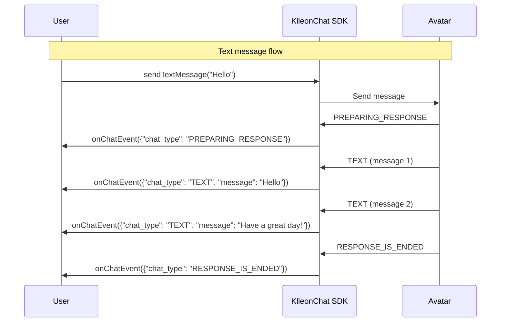
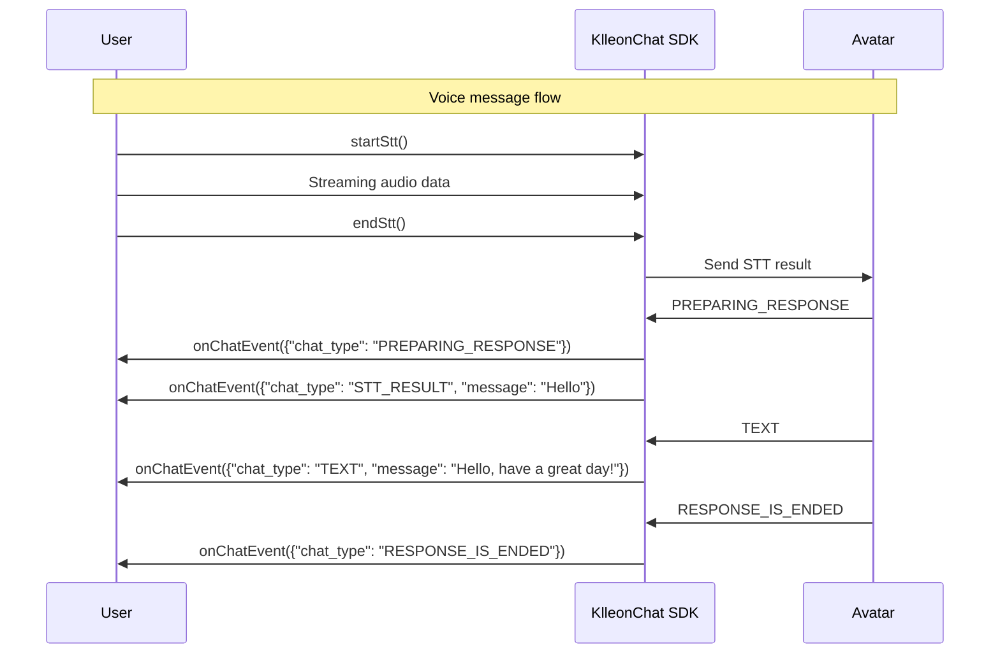
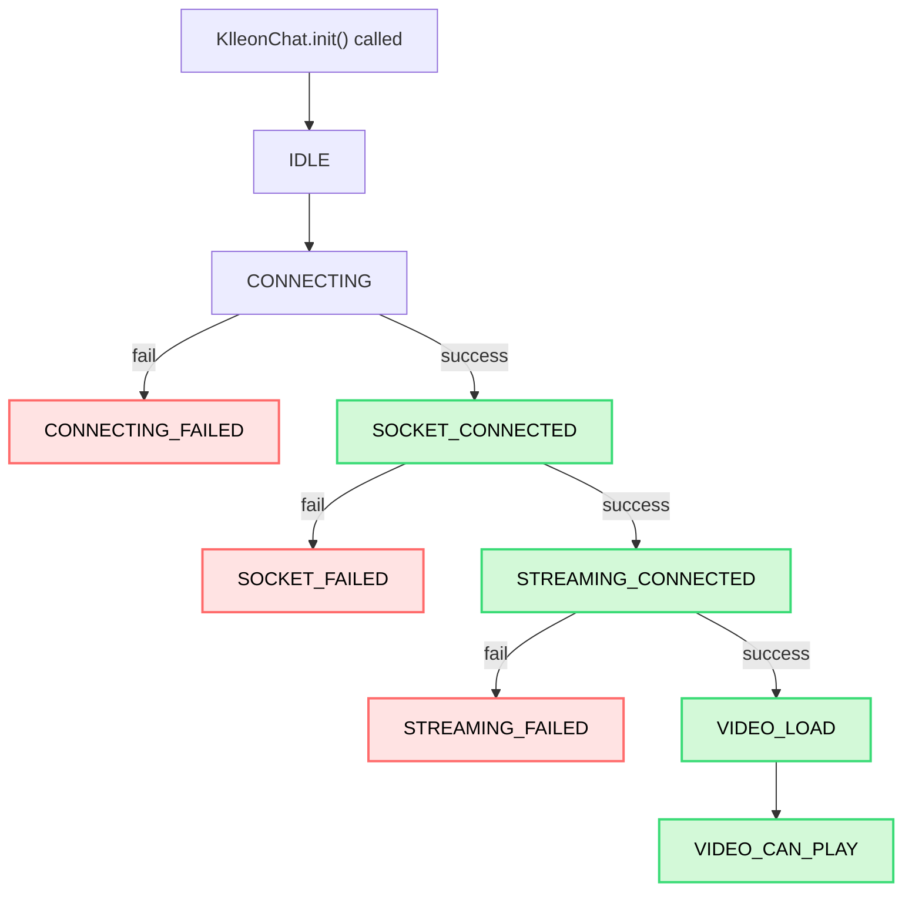

import { Table } from "@site/src/components/table/Table";
import Tabs from "@theme/Tabs";
import TabItem from "@theme/TabItem";
import { usage } from "@site/src/data/usage";
import Head from "@docusaurus/Head";

<Head>
  <title>{`Klleon Chat SDK Event Handling - onChatEvent, onStatusEvent Usage Guide`}</title>
  <meta
    name="description"
    content="Learn how to handle avatar state changes and chat messages using onChatEvent and onStatusEvent in the Klleon Chat SDK. Detailed flow of VIDEO_CAN_PLAY, chat_type, and status included."
  />
  <meta
    name="keywords"
    content="Klleon Chat SDK, Event Handling, onChatEvent, onStatusEvent, Status Event, VIDEO_CAN_PLAY, Chat Events, chat_type, Status Flow, Digital Human SDK, Klleon SDK, Realtime Chat Event, JavaScript Event Listener"
  />
</Head>

# Event Handling

Klleon Chat SDK uses custom events to notify your application of real-time state changes and data. By subscribing to these events, you can build dynamic experiences aligned with the SDK’s behavior.

## Registering and Managing Event Listeners

### `KlleonChat.onChatEvent(callback)`

Registers a callback function that is triggered whenever a chat message related to the avatar or user is received. This allows you to build a custom chat UI without relying on the SDK’s `<chat-container>` component.

- **callback** (`(data: ChatData) => void`, required): A function that receives a `ChatData` object.

```javascript
function handleChatMessage(chatData) {
  console.log("New chat message:", chatData);
}

window.KlleonChat.onChatEvent(handleChatMessage);
```

#### `ChatData` Object and `ResponseChatType` Details

<Tabs groupId="chat-data-details">
  <TabItem value="chatdata" label="ChatData Object Properties">
    The properties of the `ChatData` object passed to `onChatEvent` are:
    <Table columns={usage.en.chatDataColumns} data={usage.en.chatDataRows} />
  </TabItem>
  <TabItem value="responsetype" label="ResponseChatType Details">
    Values and meanings of the `chat_type` field in the `ChatData` object. (See
    `BaseResponseChatType`)
    <Table
      columns={usage.en.responseChatTypeValuesColumns}
      data={usage.en.responseChatTypeValuesData}
    />
  </TabItem>
</Tabs>

### ChatData Flow

#### Sending a Text Message



#### Sending a Voice Message



---

### `KlleonChat.onStatusEvent(callback)`

Registers a callback function that is triggered when the SDK or avatar’s internal status changes.

- **callback** (`(status: Status) => void`, required): A function receiving the current status as a string.

```javascript
function handleSdkStatus(currentStatus) {
  console.log("SDK Status Changed:", currentStatus);

  if (currentStatus === "VIDEO_CAN_PLAY") {
    console.log("Avatar video is ready! You can now use other SDK methods.");
  }
}

window.KlleonChat.onStatusEvent(handleSdkStatus);
```

:::caution SDK Method Usage Prerequisite
Most SDK methods (e.g., sending messages, STT functions) must be called only when the avatar is fully connected and in a **`VIDEO_CAN_PLAY`** state. This state is communicated through `onStatusEvent`. Calling methods before this state may lead to unexpected behavior.

`KlleonChat.init()` and event listener methods (`onChatEvent`, `onStatusEvent`) are exceptions to this rule.
:::

#### Status Event Arguments

<Table
  columns={usage.en.statusEventArgumentColumns}
  data={usage.en.statusEventArgumentRows}
/>

#### Available Status Values

<Table
  columns={usage.en.statusPossibleValuesColumns}
  data={usage.en.statusPossibleValuesData}
/>

#### Status Event Flow



:::info Re-registering Callbacks
If `onChatEvent` or `onStatusEvent` is called multiple times for the same event type, only the most recently registered callback remains active. Older callbacks are automatically removed. There’s no explicit `off` method.
:::
