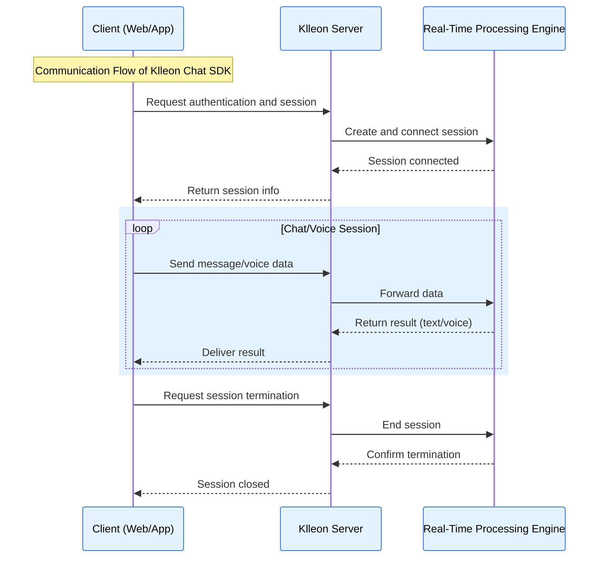

---

id: intro
sidebar_position: 1
title: Introduction
sidebar_label: intro

---

import Head from "@docusaurus/Head";

<Head>
  <title>{`Introduction to Klleon Chat SDK - Real-Time AI Avatar Chat, LLM, TTS, Lip Sync`}</title>
  <meta
    name="description"
    content="Klleon Chat SDK is a JavaScript library for easily implementing real-time avatar chat, speech synthesis (TTS), LLM integration, and lip sync in web applications. Start talking with avatars without any server setup."
  />
  <meta
    name="keywords"
    content="Klleon Chat SDK, Digital Human, AI Avatar, JavaScript SDK, Real-Time Chat, LLM, TTS, Lip Sync, Conversational AI, Web Avatar Chatbot, Klleon, AI Startup, Web-Based AI, Avatar Voice Chat, TypeScript Support"
  />
</Head>

# Introduction to Klleon Chat SDK

The Klleon Chat SDK is a JavaScript library designed to help you easily integrate Klleon's real-time interactive avatars into your web applications. With this SDK, you can build a live avatar chat interface using just a few lines of code—without needing to configure WebRTC or implement server-side logic.

## Key Features

- **Easy Integration**: Quickly set up the Klleon Chat SDK on your web page using a simple `<script>` tag, and integrate avatar features with an intuitive API.
- **Real-Time Bidirectional Communication**: Delivers a real-time chat experience with support for both text and voice messages between users and avatars.
- **Customizable UI**: Use the built-in avatar and chat UI components or build your own UI to match your brand identity.
- **Extensive SDK Event Subscription**: Subscribe to key events such as status changes and chat updates to incorporate avatar behavior into your app logic.
- **TypeScript Support**: Offers `.d.ts` type definition files for enhanced developer experience and type safety in TypeScript projects.

## Who Is This Document For?

This documentation is intended for:

- **Web Developers**: Developers who want to integrate Klleon's avatar chat features into their websites or web apps.
- **Product Managers & Planners**: Those evaluating the capabilities of the Klleon Chat SDK to enhance their services with new interactive features.
- **Anyone Curious**: Anyone interested in understanding what the Klleon Chat SDK is and how it can be used.

Through this document, you'll learn how to install and use the SDK—from basic setup to advanced use cases—and bring engaging avatar experiences into your product.

## Communication Architecture

