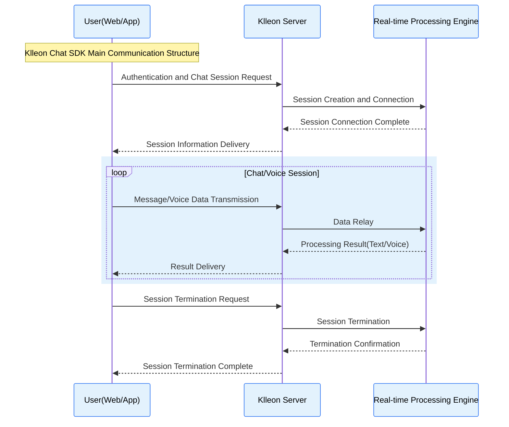

# Klleon Chat SDK Introduction

Klleon Chat SDK is a JavaScript library designed to easily integrate Klleon's real-time interactive avatars into web applications. With this SDK, users can implement chat functionality that enables real-time communication with avatars using just a few lines of code, without the need for complex WebRTC setup or server logic implementation.

## Key Features

- **Easy Integration**: Quickly install Klleon Chat SDK by adding a `<script>` tag to your web page and immediately integrate avatar functionality using intuitive APIs.
- **Real-time Bidirectional Communication**: Provides a user experience for real-time exchange of text and voice messages between users and avatars.
- **Customizable UI**: Use the default avatar and chat UI components provided, or build your own UI as needed to match your brand identity.
- **Diverse SDK Event Subscription**: Subscribe to major events related to SDK status changes and chat functionality to utilize them according to your application logic.
- **TypeScript Type Definitions**: Provides `.d.ts` type definition files to enhance development convenience and type safety when using Klleon Chat SDK in TypeScript projects.
- **Various Initialization Options**: Set diverse options such as avatar language, voice speed, and log level at the Klleon Chat SDK initialization to finely control SDK behavior.

## Who is this documentation for?

This documentation is written for the following people:

- **Web Developers**: Developers who want to implement Klleon's avatar chat functionality in their websites or web applications.
- **Product Managers/Planners**: Planners or managers who want to understand Klleon Chat SDK's capabilities and possibilities to add new value to their services.
- **All Users**: Anyone curious about what Klleon Chat SDK is and how it can be utilized.

Learn everything from installation to advanced usage of Klleon Chat SDK through this documentation, and apply avatar experiences to your services using the SDK.

## Main Communication Structure

