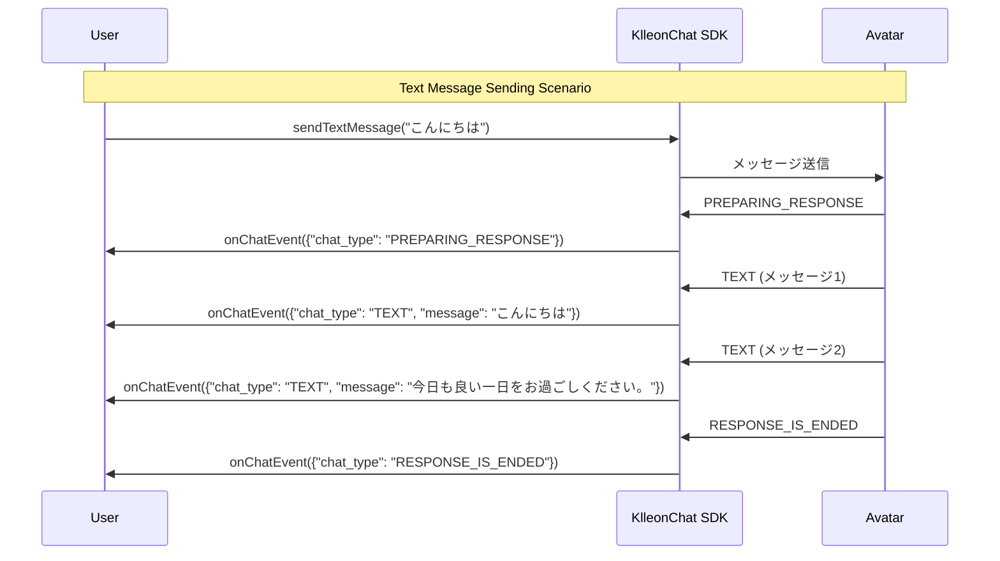
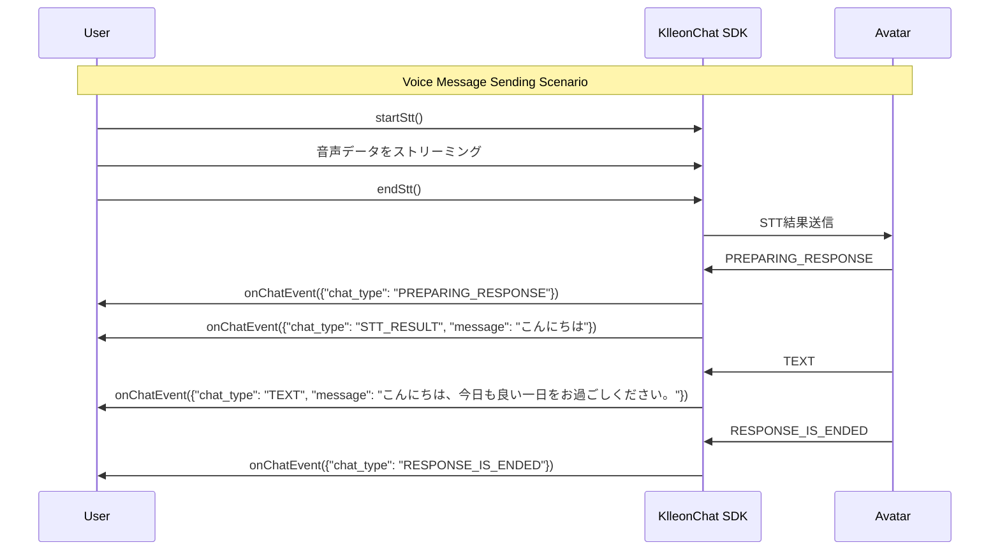
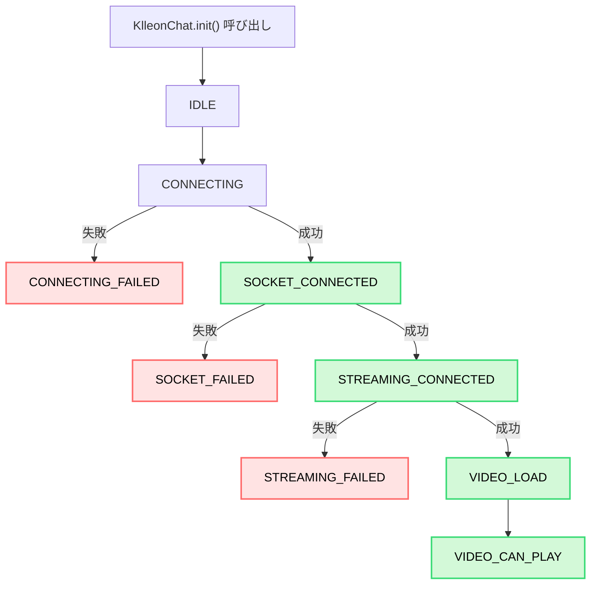

import { Table } from "@site/src/components/table/Table";
import Tabs from "@theme/Tabs";
import TabItem from "@theme/TabItem";
import { usage } from "@site/src/data/usage";
import Head from "@docusaurus/Head";

<Head>
  <title>{`Klleon Chat SDK イベント処理 - onChatEvent, onStatusEvent の使い方`}</title>
  <meta
    name="description"
    content="Klleon Chat SDKが提供するonChatEventとonStatusEventを活用してアバターの状態変化やチャットメッセージを処理する方法を案内します。VIDEO_CAN_PLAY、chat_type、statusの流れも詳しく解説しています。"
  />
  <meta
    name="keywords"
    content="Klleon Chat SDK, イベント処理, onChatEvent, onStatusEvent, statusイベント, VIDEO_CAN_PLAY, チャットイベント, chat_type, STATUSフロー, デジタルヒューマンSDK, クレオンSDK, リアルタイムチャットイベント, JavaScriptイベントリスナー"
  />
</Head>

# イベント処理

Klleon Chat SDK は、リアルタイムで発生するさまざまな状態変化やデータをアプリケーションに通知するためにカスタムイベントを使用します。これらのイベントを購読することで、SDK の動作に連動した動的な機能を実装できます。

## イベントリスナーの登録と管理

### `KlleonChat.onChatEvent(callback)`

アバターまたはユーザーに関連するチャットメッセージが発生した際に呼び出されるコールバック関数を登録します。このイベントを活用することで、SDK が提供する `<chat-container>` UI コンポーネントを使用せず、受信した `ChatData` に基づいた独自のチャットインターフェースを実装できます。

- **callback** (`(data: ChatData) => void`, 必須): `ChatData` オブジェクトを引数に取るコールバック関数です。

```javascript
function handleChatMessage(chatData) {
  console.log("新しいチャットメッセージ:", chatData);
}

window.KlleonChat.onChatEvent(handleChatMessage);
```

#### `ChatData` & `ResponseChatType`

<Tabs groupId="chat-data-details">
  <TabItem value="chatdata" label="ChatData">
    `onChatEvent` コールバックを通じて渡される `ChatData`
    オブジェクトのプロパティは以下のとおりです。
    <Table columns={usage.ja.chatDataColumns} data={usage.ja.chatDataRows} />
  </TabItem>
  <TabItem value="responsetype" label="ResponseChatType">
    `ChatData` オブジェクトの `chat_type`
    に設定される値とその意味は以下の通りです（`BaseResponseChatType` を参照）。
    <Table
      columns={usage.ja.responseChatTypeValuesColumns}
      data={usage.ja.responseChatTypeValuesData}
    />
  </TabItem>
</Tabs>

### ChatData の流れ

#### テキストメッセージ送信



#### 音声メッセージ送信



:::tip
`onChatEvent` を利用することで、SDK のデフォルト `<chat-container>` を使わずに、アプリケーションに最適化された独自のチャット UI を構築可能です。
:::

---

### `KlleonChat.onStatusEvent(callback)`

SDK およびアバターの主要な状態変化時に呼び出されるコールバック関数を登録します。

- **callback** (`(status: Status) => void`, 必須): SDK またはアバターの現在の状態を示す `Status` 文字列を受け取るコールバック関数です。

```javascript
function handleSdkStatus(currentStatus) {
  console.log("SDKの状態が変化しました:", currentStatus);

  if (currentStatus === "VIDEO_CAN_PLAY") {
    console.log(
      "アバター映像の再生準備が完了しました！他のSDKメソッドが利用可能です。"
    );
  }
}

window.KlleonChat.onStatusEvent(handleSdkStatus);
```

:::caution SDK メソッドの利用条件
ほとんどの SDK メソッド（例: メッセージ送信、STT 機能など）は、アバターが正常に接続され **映像再生が可能な状態（`VIDEO_CAN_PLAY`）であることが前提条件です**。この状態は `onStatusEvent` によって通知されます。

`VIDEO_CAN_PLAY` でない場合にメソッドを呼び出すと、期待通りに動作しないか、エラーが発生する可能性があります。

なお、`KlleonChat.init()` および `onChatEvent`、`onStatusEvent` の登録はこの条件の対象外です。
:::

#### `Status` イベント引数の詳細

<Table
  columns={usage.ja.statusEventArgumentColumns}
  data={usage.ja.statusEventArgumentRows}
/>

#### `Status` の値の詳細

<Table
  columns={usage.ja.statusPossibleValuesColumns}
  data={usage.ja.statusPossibleValuesData}
/>

#### Status イベントの流れ



:::info コールバックの再登録
`onChatEvent` または `onStatusEvent` を同一のイベントタイプに対して複数回呼び出すと、最後に登録されたコールバック関数のみが有効になります。つまり、新しいコールバックを登録すると以前のものは自動的に解除されます。明示的な `off` メソッドは提供されていません。
:::
