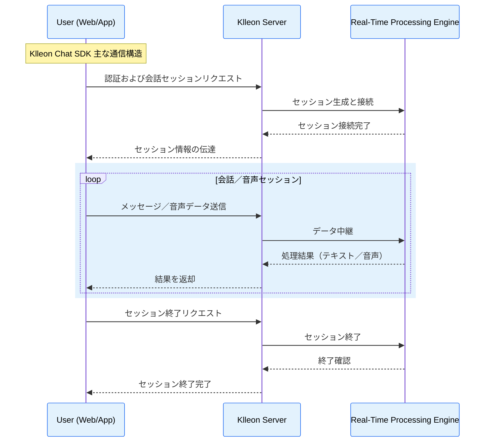

import Head from "@docusaurus/Head";

<Head>
  <title>{`Klleon Chat SDK 紹介 - リアルタイムAIアバターチャット、LLM、TTS、リップシンク`}</title>
  <meta
    name="description"
    content="Klleon Chat SDKは、リアルタイムアバターチャット、音声合成（TTS）、LLM連携、リップシンクなどの多様なAI技術をWeb上で簡単に実装できるJavaScriptライブラリです。サーバー不要でアバターとの会話を始めましょう。"
  />
  <meta
    name="keywords"
    content="Klleon Chat SDK, デジタルヒューマン, AIアバター, JavaScript SDK, リアルタイムチャット, LLM, TTS, リップシンク, 対話型AI, Webアバターチャットボット, Klleon, AIスタートアップ, WebベースAI, アバター音声チャット, TypeScript対応"
  />
</Head>

# Klleon Chat SDK 紹介

Klleon Chat SDK は、Web アプリケーションに Klleon のリアルタイムインタラクティブアバターを簡単に統合できるように開発された JavaScript ライブラリです。複雑な WebRTC 設定やサーバーロジックの実装なしに、数行のコードでアバターとリアルタイムに会話できるチャット機能を構築できます。

## 主な特徴

- **簡単な連携**：Web ページに `<script>` タグを追加するだけで Klleon Chat SDK をすぐに導入でき、直感的な API でアバター機能を迅速に連携できます。
- **リアルタイム双方向通信**：ユーザーとアバター間でテキストおよび音声メッセージをリアルタイムでやり取りできる UX を提供します。
- **カスタマイズ可能な UI**：デフォルトで提供されるアバターおよびチャット UI コンポーネントを利用するか、必要に応じて UI を構築し、ブランドアイデンティティに合わせることができます。
- **多様な SDK イベントの購読**：SDK の状態変化やチャット関連の主要イベントを購読し、アプリケーションロジックに活用できます。
- **TypeScript 型定義の提供**：`.d.ts` 型定義ファイルが用意されており、TypeScript プロジェクトでも開発の利便性と型安全性を高められます。

## このドキュメントは誰のため？

このドキュメントは以下のような方々を対象としています：

- **Web 開発者**：自身の Web サイトやアプリに Klleon のアバターチャット機能を実装したい開発者。
- **プロダクトマネージャー／企画者**：Klleon Chat SDK の機能と可能性を把握し、サービスに新たな価値を加えたい企画者またはマネージャー。
- **すべてのユーザー**：Klleon Chat SDK とは何か、どう活用できるのかを知りたいすべての方。

このドキュメントを通じて、Klleon Chat SDK の導入から応用までを学び、サービスにアバター体験を取り入れてみてください。

## 主な通信構造

