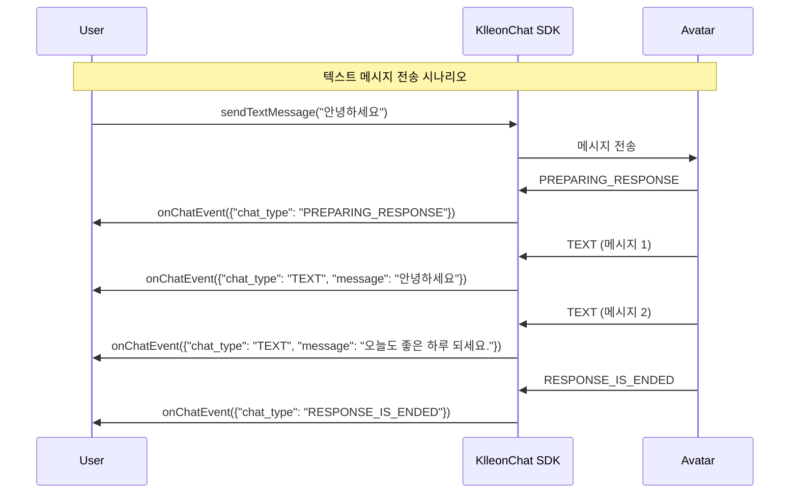
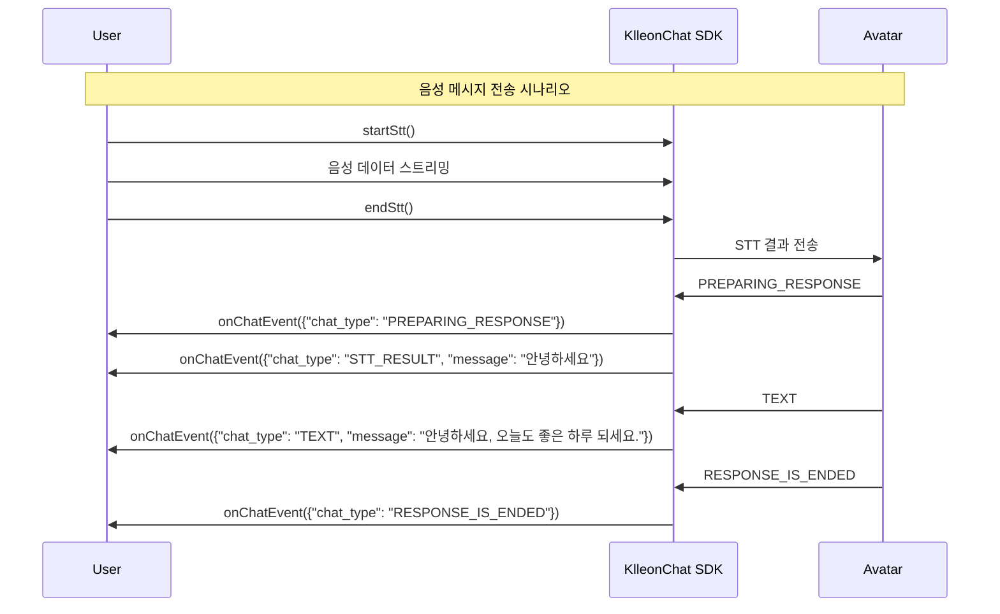
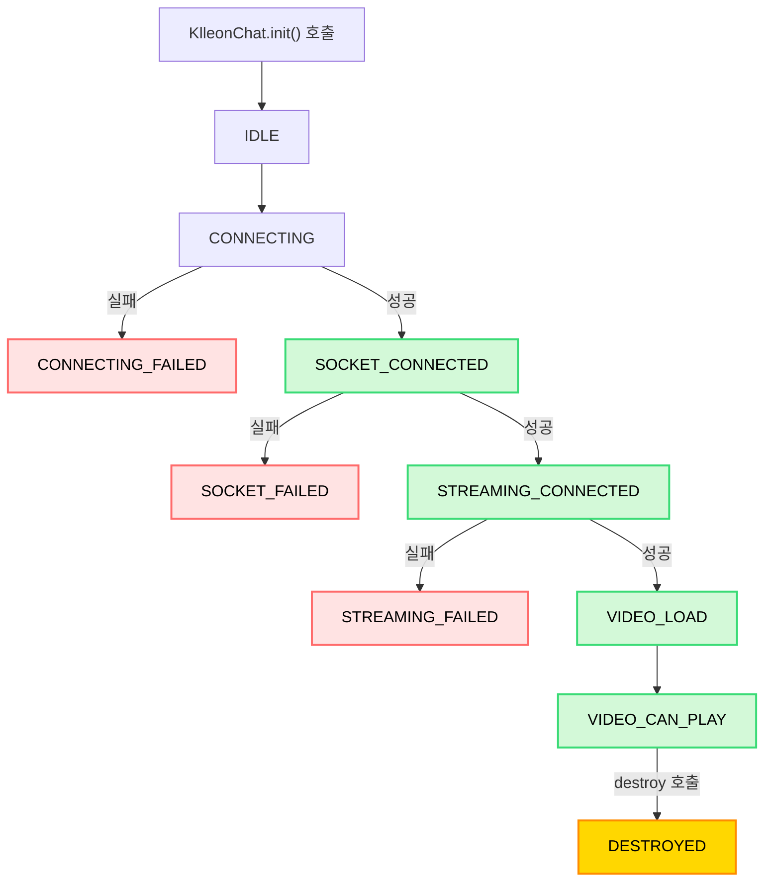

import { Table } from "@site/src/components/table/Table";
import Tabs from "@theme/Tabs";
import TabItem from "@theme/TabItem";
import { usage } from "@site/src/data/usage";
import Head from "@docusaurus/Head";

<Head>
  <title>{`Klleon Chat SDK 이벤트 처리 - onChatEvent, onStatusEvent 사용법`}</title>
  <meta
    name="description"
    content="Klleon Chat SDK에서 제공하는 onChatEvent와 onStatusEvent를 활용해 아바타 상태 변화와 채팅 메시지를 처리하는 방법을 안내합니다. VIDEO_CAN_PLAY, chat_type, status 흐름까지 상세하게 정리되어 있습니다."
  />
  <meta
    name="keywords"
    content="Klleon Chat SDK, 이벤트 처리, onChatEvent, onStatusEvent, status 이벤트, VIDEO_CAN_PLAY, 채팅 이벤트, chat_type, STATUS 흐름도, 디지털 휴먼 SDK, 클레온 SDK, 실시간 채팅 이벤트, 자바스크립트 이벤트 리스너"
  />
</Head>

# 이벤트 처리

Klleon Chat SDK는 실시간으로 발생하는 다양한 상태 변화와 데이터를 애플리케이션에 알리기 위해 커스텀 이벤트를 사용합니다. 이러한 이벤트를 구독하여 SDK의 동작에 맞춰 동적인 기능을 구현할 수 있습니다.

## 이벤트 리스너 등록 및 관리

### `KlleonChat.onChatEvent(callback)`

아바타 또는 사용자와 관련된 채팅 메시지 발생 시 호출되는 콜백 함수를 등록합니다. 이 이벤트를 활용하면 SDK에서 제공하는 `<chat-container>` UI 컴포넌트를 사용하지 않고도, 수신되는 `ChatData`를 기반으로 애플리케이션에 맞는 자체적인 채팅 인터페이스를 구현할 수 있습니다.

- **callback** (`(data: ChatData) => void`, 필수): `ChatData` 객체를 인자로 받는 콜백 함수입니다.

```javascript
function handleChatMessage(chatData) {
  console.log("새 채팅 메시지:", chatData);
}

window.KlleonChat.onChatEvent(handleChatMessage);
```

#### `ChatData` 객체 및 `ResponseChatType` 상세

<Tabs groupId="chat-data-details">
  <TabItem value="chatdata" label="ChatData 객체 속성">
    `onChatEvent` 콜백을 통해 전달되는 `ChatData` 객체의 속성은 다음과 같습니다.
    <Table columns={usage.ko.chatDataColumns} data={usage.ko.chatDataRows} />
  </TabItem>
  <TabItem value="responsetype" label="ResponseChatType 값 상세">
    `ChatData` 객체의 `chat_type` 속성에 올 수 있는 값들과 그 의미는 다음과
    같습니다. (`BaseResponseChatType` 참고)
    <Table
      columns={usage.ko.responseChatTypeValuesColumns}
      data={usage.ko.responseChatTypeValuesData}
    />
  </TabItem>
</Tabs>

### ChatData Flow

#### 텍스트 메시지 전송



#### 음성 메시지 전송



:::tip
`onChatEvent`를 통해 SDK의 기본 `<chat-container>`를 사용하지 않고, 실제로 애플리케이션에 맞는 커스텀 채팅창을 자유롭게 구축할 수 있습니다.
:::

---

### `KlleonChat.onStatusEvent(callback)`

SDK 및 아바타의 주요 상태 변경 시 호출되는 콜백 함수를 등록합니다.

- **callback** (`(status: Status) => void`, 필수): 현재 SDK 또는 아바타의 상태를 나타내는 `Status` 문자열을 인자로 받는 콜백 함수입니다.

```javascript
function handleSdkStatus(currentStatus) {
  console.log("SDK 상태 변경:", currentStatus);

  if (currentStatus === "VIDEO_CAN_PLAY") {
    console.log(
      "아바타 영상 재생 준비 완료! 이제 다른 SDK 메서드를 사용할 수 있습니다."
    );
  }
}

window.KlleonChat.onStatusEvent(handleSdkStatus);
```

:::caution SDK 메서드 사용 전제 조건
대부분의 SDK 메서드 (예: 메시지 전송, STT 기능 등)는 아바타와 정상적으로 연결되어 **영상 재생이 가능한 상태(`VIDEO_CAN_PLAY`)일 때 호출**해야 합니다. 이 상태는 `onStatusEvent`를 통해 전달되는 상태 값으로 확인할 수 있습니다. `VIDEO_CAN_PLAY` 상태가 아닐 때 메서드를 호출하면 예상대로 동작하지 않거나 오류가 발생할 수 있습니다.

`KlleonChat.init()` 및 이벤트 리스너 등록 메서드(`onChatEvent`, `onStatusEvent`)는 이 전제 조건에서 제외됩니다.
:::

#### `Status` 이벤트 인자 상세

<Table
  columns={usage.ko.statusEventArgumentColumns}
  data={usage.ko.statusEventArgumentRows}
/>

#### `Status` 값 상세

<Table
  columns={usage.ko.statusPossibleValuesColumns}
  data={usage.ko.statusPossibleValuesData}
/>

### Status 이벤트 흐름



### `KlleonChat.onErrorEvent(callback)`

SDK 동작 중 발생하는 오류를 감지할 수 있는 이벤트 리스너입니다. WebSocket 연결 실패, 스트리밍 오류, 비디오 요소 문제 등 다양한 오류 상황을 실시간으로 모니터링할 수 있습니다.

- **callback** (`(error: ErrorData) => void`, 필수): 오류 정보를 담은 `ErrorData` 객체를 인자로 받는 콜백 함수입니다.

```tsx title="App.tsx (onErrorEvent 사용 예제)"
import { useEffect, useRef } from "react";

function App() {
  const reconnectAttempts = useRef(0);
  const maxReconnectAttempts = 3;

  useEffect(() => {
    const { KlleonChat } = window;

    const handleError = (errorData) => {
      console.error("SDK 오류 발생:", errorData);

      switch (errorData.code) {
        case "SOCKET_FAILED":
        case "STREAMING_FAILED":
        case "STREAMING_RECONNECT_FAILED":
          if (reconnectAttempts.current < maxReconnectAttempts) {
            console.log(
              `재연결 시도 ${
                reconnectAttempts.current + 1
              }/${maxReconnectAttempts}`
            );
            reconnectAttempts.current++;

            KlleonChat.reconnect()
              .then(() => {
                console.log("재연결 성공");
                reconnectAttempts.current = 0; // 성공 시 카운터 리셋
              })
              .catch((error) => {
                console.error("재연결 실패:", error);
                if (reconnectAttempts.current >= maxReconnectAttempts) {
                  console.error("최대 재연결 시도 횟수 초과");
                  // 사용자에게 지속적인 문제 시 문의 안내
                  alert(
                    "연결에 문제가 있습니다. 지속적인 문제가 발생하는 경우 support@klleon.com으로 문의해주세요."
                  );
                }
              });
          }
          break;
        case "VIDEO_ELEMENT_NOT_FOUND":
          console.log("비디오 요소 없음 - avatar-container 확인 필요");
          // UI 요소 렌더링 상태 확인
          break;
        case "SOCKET_DISCONNECTED_UNEXPECTEDLY":
        case "STREAMING_DISCONNECTED_UNEXPECTEDLY":
          console.log("연결이 예기치 않게 끊어짐");
          // 애플리케이션 상황에 따라 재연결 또는 사용자 알림
          break;
        default:
          console.log("알 수 없는 오류:", errorData.message);
      }
    };

    KlleonChat.onErrorEvent(handleError);
  }, []);

  return (
    <div>
      <avatar-container />
      <chat-container />
    </div>
  );
}

export default App;
```

#### `ErrorData` 객체 상세

<Table columns={usage.ko.errorDataColumns} data={usage.ko.errorDataRows} />

#### 에러 코드 상세

<Table columns={usage.ko.errorTypeColumns} data={usage.ko.errorTypeData} />

:::info 에러 처리 가이드라인
`onErrorEvent`를 통해 받은 오류 정보를 바탕으로 애플리케이션에 적합한 오류 처리 로직을 구현하세요.

- **사용자 알림**: 오류 상황을 사용자에게 알리고 적절한 안내 메시지 제공
- **수동 재연결**: `reconnect()` 메서드를 사용한 수동 재연결 (재연결 시도 횟수 제한 권장)
- **지속적 문제 시 문의 안내**: 심각한 연결 문제가 지속될 경우 support@klleon.com으로 문의 안내
- **오류 로깅**: 오류 정보를 로그 시스템에 기록하여 디버깅 지원

**연결 실패 오류 (`SOCKET_FAILED`, `STREAMING_FAILED`)**: SDK 연결 시도 중 발생한 오류로, 수동 재연결이 필요합니다.

**재연결 타임아웃 오류 (`STREAMING_RECONNECT_FAILED`)**: 스트리밍이 네트워크 환경에 따라 자동으로 재연결을 시도하지만 타임아웃으로 실패한 상황입니다.

**재연결 시도 횟수 제한**: SDK 내부적으로 오류가 있는 경우 무한 재연결이 발생할 수 있으므로, 클라이언트 애플리케이션에서 재연결 시도 횟수를 제한하는 것을 권장합니다. 일반적으로 3회 정도로 제한하고, 실패 시 지속적인 문제가 있는 경우 support@klleon.com으로 문의해주세요.

각 오류 상황에 대한 처리 방식은 애플리케이션의 특성과 사용자 경험을 고려하여 결정하시기 바랍니다.
:::

:::info 콜백 재등록
`onChatEvent`, `onStatusEvent`, `onErrorEvent`를 동일한 이벤트 타입에 대해 여러 번 호출하면, 마지막으로 등록된 콜백 함수만 활성화됩니다. 즉, 새 콜백을 등록하면 이전 콜백은 자동으로 해제됩니다. 명시적인 `off` 메서드는 제공되지 않습니다.
:::
